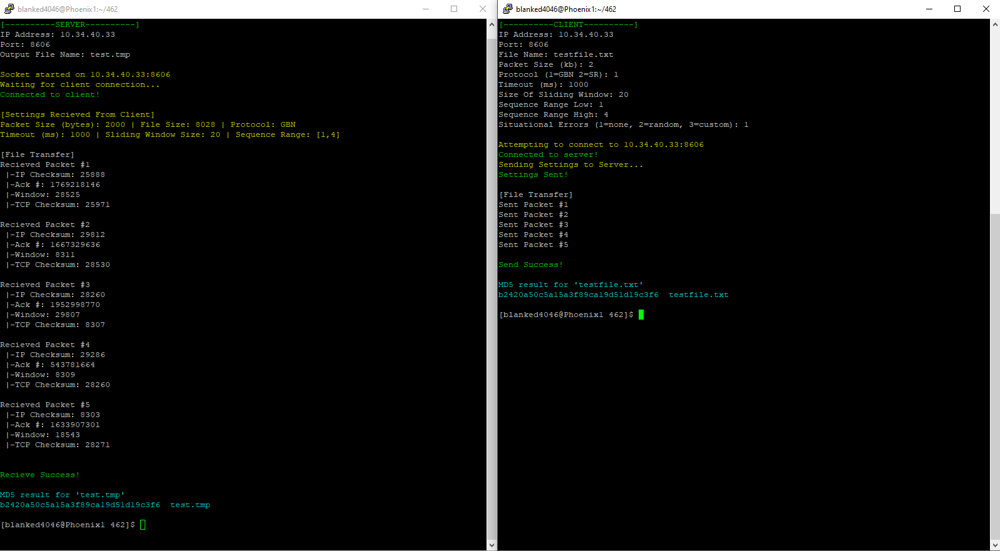

# CS 462 - Sliding Window Protocols Team Project

 

## Prototype Screenshot

## TODO
1. Implement Internet Checksum or the CRC checksum algorithm to ensure server/client connection security
2. Implement Go-Back-N & Selective Repeat protocol simulations
