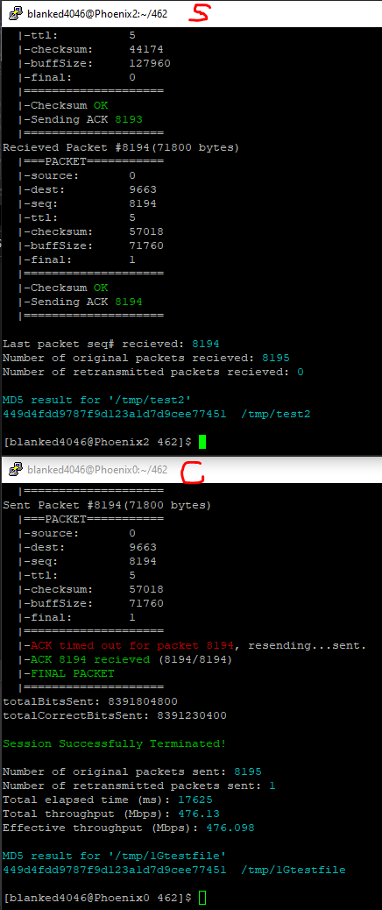

# CS 462 - Sliding Window Protocols Team Project

 

## Prototype Screenshot

## TODO
1. Implement CRC Checksum                                           [In Progress]
3. Implement Go-Back-N & Selective Repeat protocol simulations      [Not Started]
